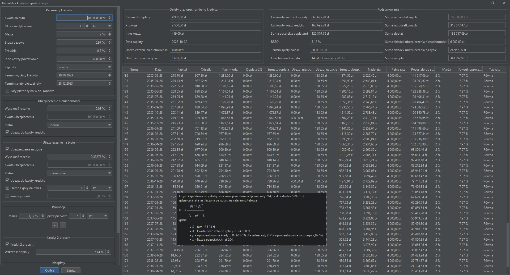

# Zaawansowany kalkulator rat kredytu hipotecznego ~~oraz RRSO~~

Pozwala obliczyć dokładnie raty kredytu biorąc pod uwagę:
- suma i okres kredytowania
- termin wypłaty
- dzień spłaty rat (można automatycznie pomijać dni wolne)
- stopa bazowa i marża
- dodatkowe koszty początkowe (np. kontrola nieruchomości)
- ubezpieczenia
  - zmiana kwoty ubezpieczenia
  - płatne co roku lub co miesiąc
  - płatne z góry na zadany okres z inną wysokością
- promocyjne marże (można tym sterować zmianę oprocentowania dla wybranych okresów)
- nezpieczny kredyt 2%
- nadpłaty od zadanego miesiąca
  - stała wysokość nadpłat
  - stała wysokość całej raty

Wszysktkie obliczone wartości posiadają ToolTip z wyjaśnieniem, jak zostały obliczone.

